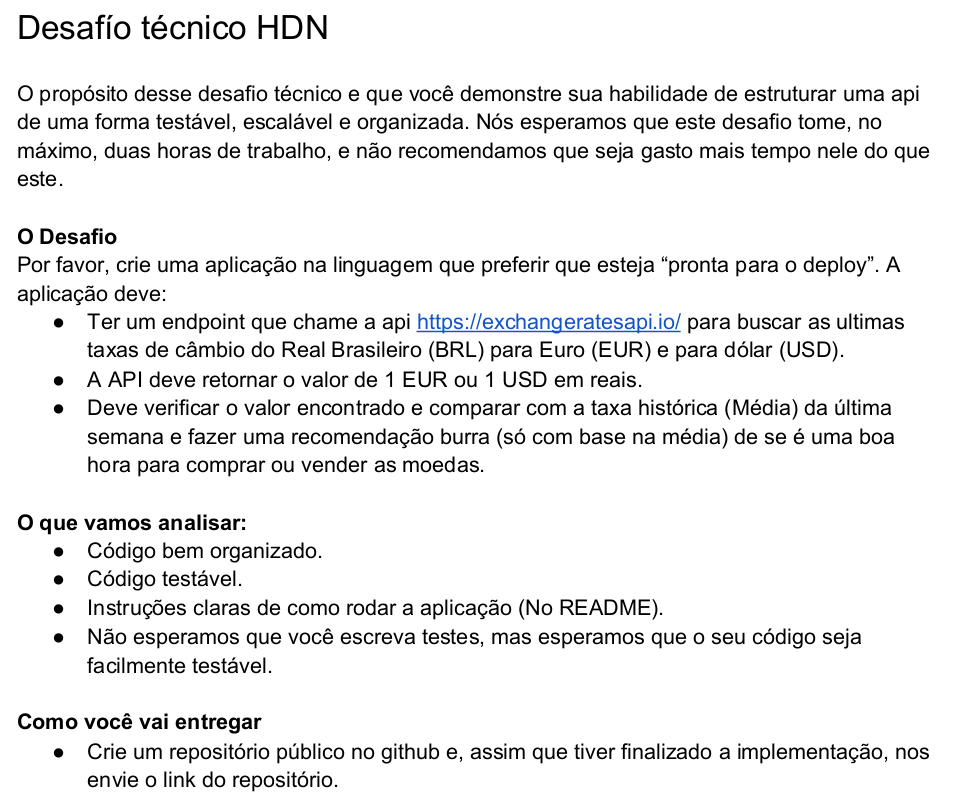

# HDN-Challange
Desafio proposto pela HDN a fim de avaliar meu conhecimento técnico sobre tecnologias familiares.
O projeto foi desenvolvido na linguagem **JAVA** utilizando **Spring Boot Framework**
# Descrição

# Deploy
Para gerar o pacote para deploy **Linux**
- navege até o nível /**{REPO_HOME}/hdn-challage**;
- execute o comando *mvn clean install*;
- navege atá o nível **/hdn-challange/target/**
- execute o comando *java -jar hdn-challange-0.0.1-SNAPSHOT.jar*